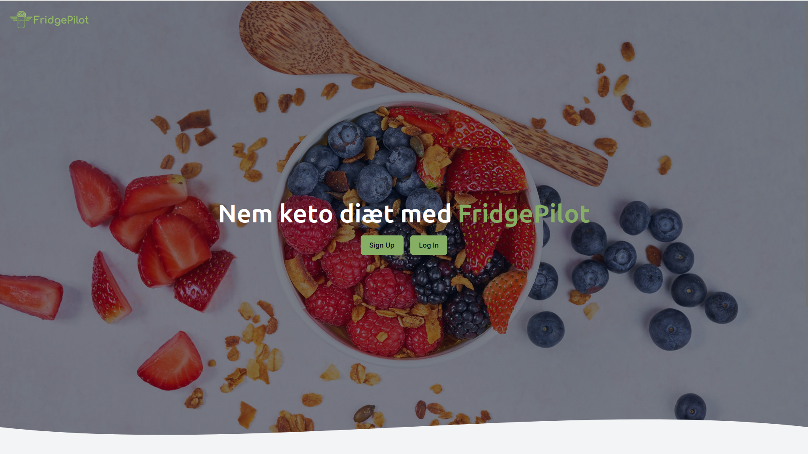
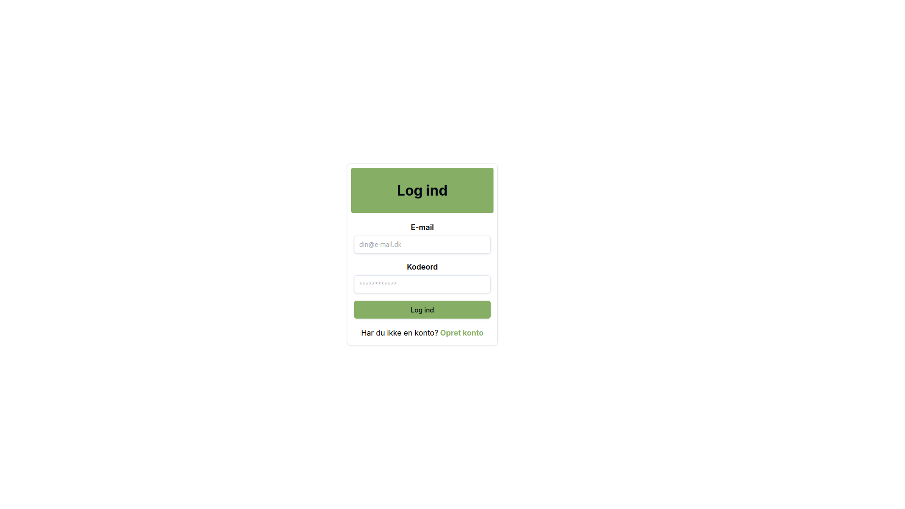
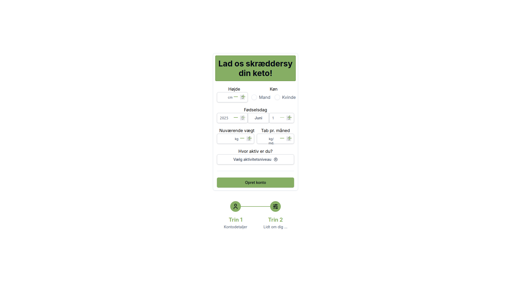
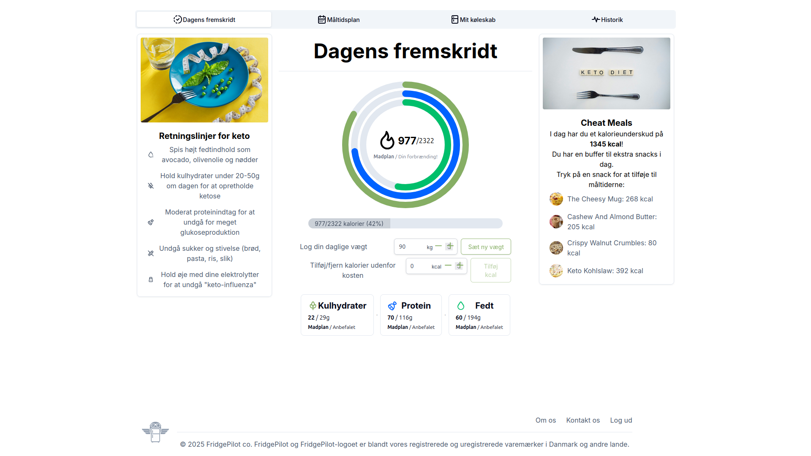
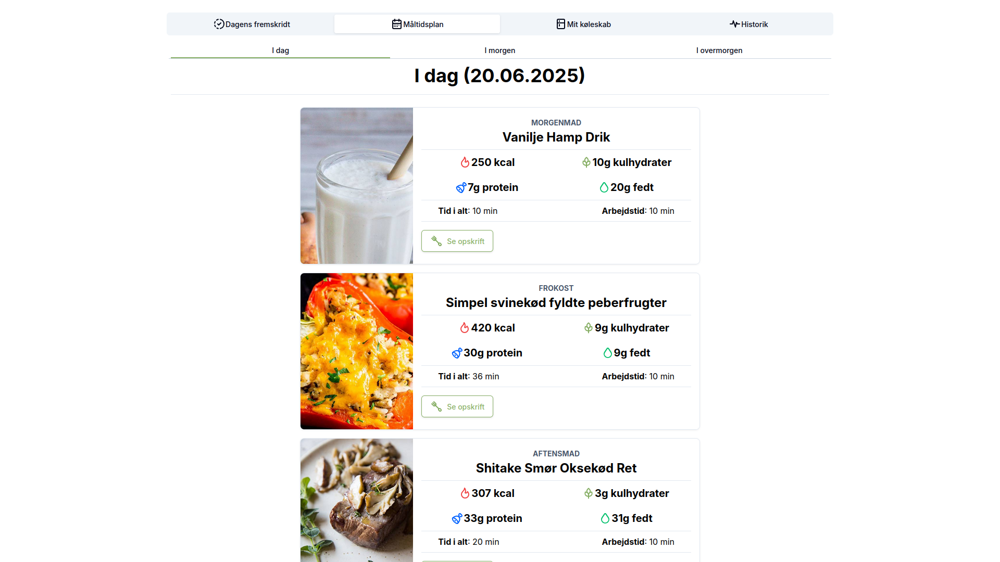
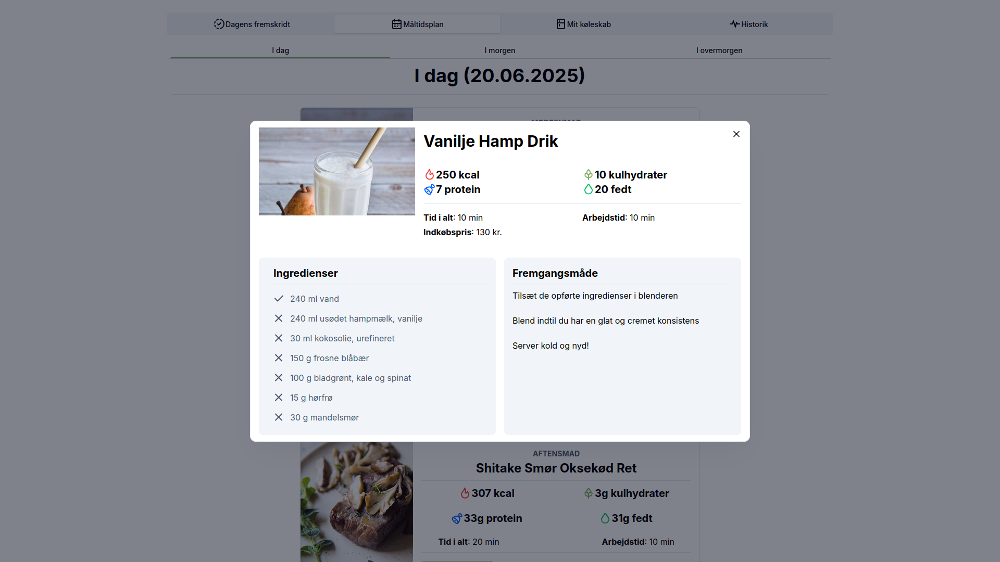
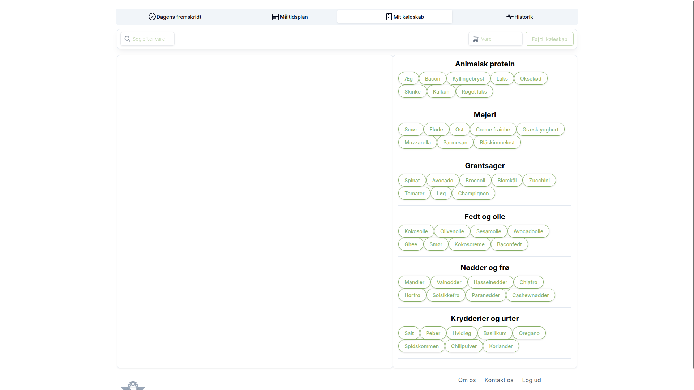
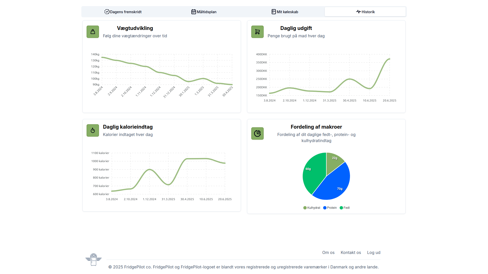

# Fridge-Pilot

# How many calories in each meal from total calorie intake:
1. Morning (breakfast): 25% of daily calories

2. Midday (lunch): 40%

3. Afternoon/Evening (dinner): 35%

# Meal Selection Algorithm
This document describes how the meal planner selects recipes to create personalized keto meal plans based on user preferences and available ingredients.

# Images of platform
1. Landing page:

2. Login page:

3. Register page:

4. Main page:

5. Mealplan page:

6. Recipe page:

7. Fridge page:

8. Progress page:

